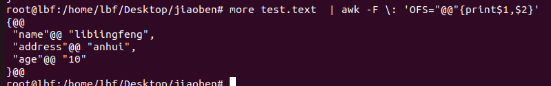

# SpringBootJpaTest
Jpa测试库


## git error: RPC failed； curl 28 OpenSSL SSL_read: Connection was reset, errno 10054 fatal: expected解决
```
git config --global http.sslVerify "false"
```

awk命令：
示例：
```shell
more test.text  | awk -F \: '{print $2}' | awk -F \, '{print$1}'

more test.text  | awk -F \: 'OFS="@@"{print$1,$2}'
```


```markdown
 -F : awk选项，指定输入分隔符为: ;
 '{print $n}' 固定语法
 $1, $2, $5：输出第一个，第二个，第五个字段
 ， ：是输出分隔符，如果不加默认是没有分隔符的
 OSF="@@@": 表示以@@@为分隔符进行输出
```